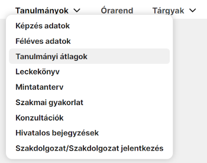

# Neptun MakeUp

*Egy kis smink nem árthat a Neptunnak se...*

---

A **Neptun MakeUp** a minden egyetemista által imádott felületet modernné, frissé, és letisztulttá varázsolja pár kattintással.

A Neptun MakeUp létrejöttét inspirálta: [Neptun PowerUp!](https://github.com/solymosi/npu)

### A projekt célja

- Egy letisztult, modern felület megalkotása új betűkészlettel, színekkel, ikonokkal

- Fölösleges, zavaró elemek elrejtése (pl. a hatalmas fejléc)

- Sötét mód és saját kiemelőszín (hamarosan!)

### Telepítés folyamata

- Telepítsd az általad használt böngészőhöz kiadott Tampermonkey-t
  
  - [Google Chrome](https://chrome.google.com/webstore/detail/tampermonkey/dhdgffkkebhmkfjojejmpbldmpobfkfo), [Opera](https://addons.opera.com/en/extensions/details/tampermonkey-beta/), [Mozilla Firefox](https://addons.mozilla.org/en-US/firefox/addon/tampermonkey/), [Safari](https://apps.apple.com/us/app/tampermonkey/id1482490089)
  
  - Töltsd le a Neptun MakeUp-ot [innen](https://github.com/0pau/nmu/releases/latest/download/nmu.user.js), majd válaszd az 'Install' lehetőséget

### Egy kis ízelítő képekkel

*A teljes felület az 'Üzenetek' oldallal:*

*Letisztult lapfülek:*

*Menü:*

 
